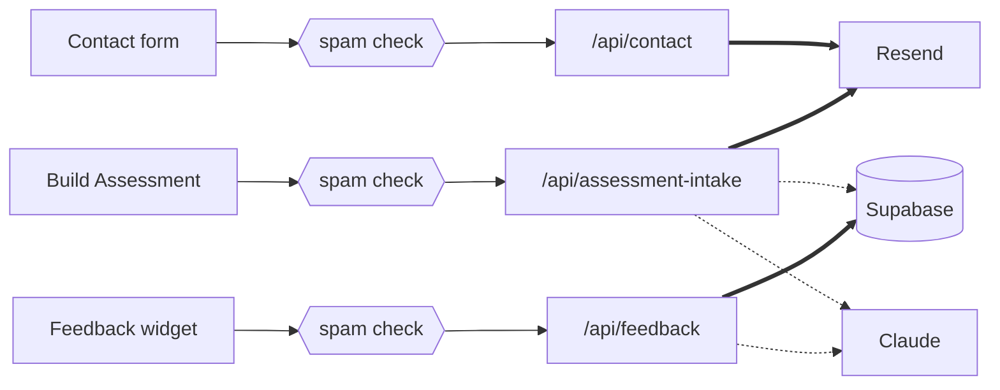

<div align="center">


# jahutton.build

**Software, systems, wires, and walls.**

The portfolio site of [Jonathan A. Hutton](https://jahutton.build) — built in the hours
around a full-time job and a kitchen remodel.

[**Live site**](https://jahutton.build) · [**How it's built**](https://jahutton.build/work/this-site/) · [**The book**](https://unflappable.press)

<br>


</div>

---

The `.build` TLD is the whole framing: **I am a builder** — of software, systems, teams,
physical spaces, organizations, and written work. This repo is the software half, and it's
public because handing someone the source beats telling them you can code.

It is deliberately small. Most of the decisions here were about what *not* to build.

---

## How it actually works

A static Astro site on Cloudflare Pages, plus three Pages Functions. The browser only ever
talks to this site — every key lives on the server, and no third-party service is reached
from the visitor's device.



**Thick arrows must succeed. Dotted arrows are allowed to fail quietly.**

## What's allowed to fail

The interesting part isn't what talks to what. It's what happens when something breaks.

| Function | Must succeed | Allowed to fail | Why |
|---|---|---|---|
| `/api/contact` | Resend | — | One job: get the message to a human. |
| `/api/assessment-intake` | Resend | Supabase, Claude | The **email** is the product. A database hiccup must never cost a lead. |
| `/api/feedback` | Supabase | Claude | The **saved row** is the product. Tagging is a bonus, so the write happens first and enrichment failure is swallowed. |

Same building blocks in the bottom two rows, opposite rules — because the thing worth
protecting is different. Which one you protect is a design decision, not a default.

## What I didn't build

| Not here | Instead |
|---|---|
| A framework | Astro components and plain HTML |
| Tailwind / a CSS library | Two hand-written CSS files on a token system |
| A component library | Thirteen components, all in this repo |
| A CMS | Copy lives in `src/data/*.js`; notes are markdown files in the repo |
| A form service | Three Pages Functions |
| Analytics | Nothing. No pixels, no cookies, no tracking. |
| A font CDN | Self-hosted, so nobody else sees you reading |
| A diagram library | The stack diagram on the site is HTML and CSS |

Four dependencies: Astro, its sitemap plugin, and two fonts. Anyone can add things. The job
is knowing what to leave out, then living with it.

## Ideas worth stealing

**Content is data, not markup.** Every word on the site lives in `src/data/`. Pages map over
it; components are presentation-only. Rewording anything is a one-line edit in a data file.
The one exception is `/notes`, where the bodies are markdown — prose with headings, lists and
quotes inside a JS file is markup smuggled into data, which is the thing this rule is against.

**One boolean hides a draft in four places.** A note's `draft: true` keeps it out of the
index, out of the routes, and out of the feed — and out of the sitemap for free, because the
mechanism is "the page does not exist." There is no sitemap rule for drafts, and there
doesn't need to be one.

**A feed without a dependency.** `/rss.xml` is forty lines of string building in a static
endpoint rather than a fifth package. The count in the badge above is a claim someone can
check in a minute, which is the point of keeping it true.

**Two-tier projects, promoted by a single field.** A project with a `slug` gets a prerendered
detail page and its card shows a short teaser. Without one, the card renders the full blurb
inline and there's no page. Promote or demote a project by adding or removing `slug` — no
page edits, no routing changes.

**Spam defense split by what abuse costs.** Turnstile is strict on the two Functions that
spend money per submit; the contact form keeps a honeypot fallback so it still works with
JavaScript off; a WAF rate limit is the hard ceiling. Three layers, three different jobs.

**Progressive enhancement, honestly.** Every Function answers JSON to `fetch` and a 303
redirect to a native form post. Turn JavaScript off and the forms still work.

**The database schema is in the repo.** `supabase/migrations/` — because the first version of
this table was clicked together in a dashboard, and when the project auto-paused there was no
record of what to recreate.

## Running it

```bash
npm install
npm run dev      # → http://localhost:4321
npm run build    # → dist/
npm run preview
```

Node 22+ required (`.nvmrc`).

The forms are Pages Functions, so the Astro dev server doesn't run them. To exercise them:

```bash
npm run build
npx wrangler pages dev dist
```

Wrangler reads secrets from `.dev.vars` — copy `.dev.vars.example` and fill in what you need.

## Layout

```
src/
  pages/        index · work · work/[slug] · services · about · now · contact
                notes · notes/[slug] · rss.xml (the only endpoint)
                thanks · thanks/build-assessment · assessment · assessment/intake
                privacy · 404
  layouts/      BaseLayout — head, meta, header/footer, skip link
  components/   Header · Footer · Banner · ProjectCard · ContactForm
                FeedbackWidget · AssessmentIntake · StackDiagram · SubstackEmbed
                NextStepCard · ProjectMetrics · ProjectParts · TechStack
  content/      notes/*.md  ← the one place words aren't data
  content.config.js         ← the notes collection schema
  data/         site · projects · about · intake · privacy · colophon · notes  ← all other copy
  styles/       tokens.css (the design system) · global.css
functions/api/  contact · assessment-intake · feedback
supabase/       migrations/
```

`src/styles/tokens.css` is shared verbatim with **[unflappable.press](https://unflappable.press)**,
the sibling site for the book, so the two read as a family rather than by coincidence.

## Built with AI, and where the line is

This site was built with heavy AI assistance, and [`CLAUDE.md`](CLAUDE.md) is in the repo so
you can see exactly how. That's the point rather than an embarrassment: shipping quickly with
AI leverage is a large part of what I do.

The line sits in a specific place. Scaffolding, refactors, plumbing, and the kind of microcopy
I'd rather not hand-write — all fair game. The writing I actually care about, the book and the
essays, is mine and stays mine. Knowing which is which is the skill; the tool is just a tool.

## Using this

There's no license file, so ordinary copyright applies and the content — the writing, the
photographs, the design — isn't up for reuse. The engineering ideas are, though. That's why
it's public. Take anything useful.

---

<div align="center">

**[jahutton.build](https://jahutton.build)** · [unflappable.press](https://unflappable.press) · [LinkedIn](https://www.linkedin.com/in/jahutton/)

</div>
