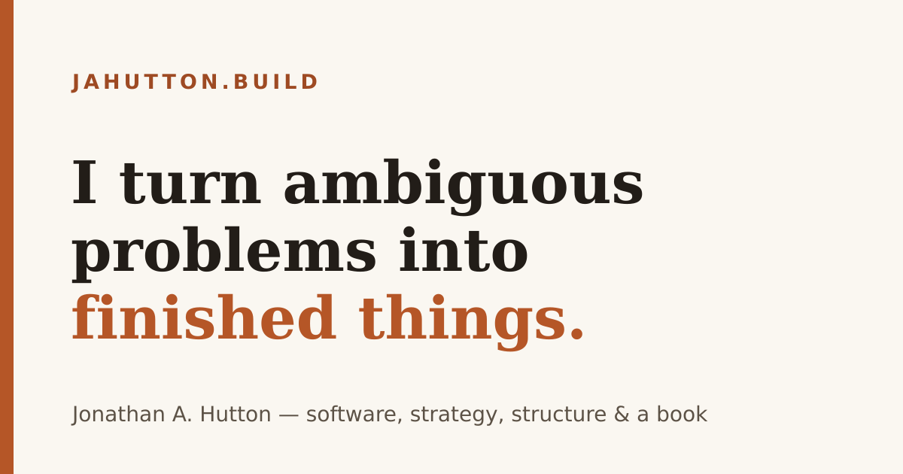
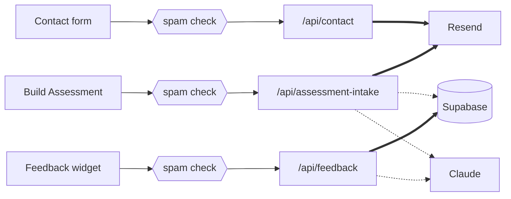

<div align="center">



# jahutton.build

**Software, systems, wires, and walls.**

Four dependencies, no framework, no CMS. The portfolio site of
[Jonathan A. Hutton](https://jahutton.build) — static Astro on Cloudflare Pages, with three
serverless functions behind the forms. Public because showing someone the source is easier
than describing it.

[**Live site**](https://jahutton.build) · [**How it's built**](https://jahutton.build/work/this-site/) · [**The book**](https://unflappable.press)

<br>


</div>

---

The `.build` TLD is the framing: I build things — software, systems, teams, physical spaces,
organizations, and a book. This repo is the software half, built in the hours around a
full-time job and a kitchen remodel. It's small on purpose; most of the decisions were about
what not to build.

## How it works

A static Astro site on Cloudflare Pages, plus three Pages Functions. The browser only ever
talks to this site — every key stays on the server, and nothing third-party loads on a
visitor's device.



Thick arrows have to succeed. Dotted arrows are allowed to fail quietly.

| Function | Must succeed | Allowed to fail | Why |
|---|---|---|---|
| `/api/contact` | Resend | — | One job: get the message to a human. |
| `/api/assessment-intake` | Resend | Supabase, Claude | The email is the lead. A paused database shouldn't cost one. |
| `/api/feedback` | Supabase | Claude | The saved row is the product, so the write happens first and the tagging is a bonus. |

Same parts in the bottom two rows, opposite rules, because the thing worth protecting is
different. That's a decision each time, not a default.

## What I didn't build

| Not here | Instead |
|---|---|
| A framework | Astro components and plain HTML |
| Tailwind or a CSS library | Two hand-written CSS files on a token system |
| A component library | Fourteen components, all in this repo |
| A CMS | Copy lives in `src/data/*.js`; notes are markdown files |
| A form service | Three Pages Functions |
| Analytics | Nothing. No pixels, no cookies, no tracking. |
| A font CDN | Self-hosted |
| A diagram library | The stack diagram on the site is HTML and CSS |

Four dependencies: Astro, its sitemap plugin, and two fonts.

## A few decisions

**Content is data, not markup.** Every word lives in `src/data/`. Pages map over it; components
only present it. The exception is `/notes`, where bodies are markdown — prose with headings and
lists inside a JS file is markup smuggled into data, which is what the rule is against.

**The forms work without JavaScript.** Every Function answers JSON to a `fetch` and a 303
redirect to a native form post, so progressive enhancement is a property of the site rather
than a claim about it.

**Spam defense sized to what abuse costs.** Turnstile is strict on the two Functions that spend
money per submit and lenient on contact, which keeps a honeypot fallback so it survives with
JavaScript off. A WAF rate limit is the ceiling.

**The database schema is in the repo.** `supabase/migrations/` — because the first version of
that table was clicked together in a dashboard, and when the project auto-paused there was no
record of what to rebuild.

## Running it

```bash
npm install
npm run dev      # → http://localhost:4321
npm run build    # → dist/
npm run preview
```

Node 22+ (`.nvmrc`). The forms are Pages Functions, so the Astro dev server won't run them:

```bash
npm run build
npx wrangler pages dev dist
```

Wrangler reads secrets from `.dev.vars` — copy `.dev.vars.example` and fill in what you need.

## Layout

```
src/       pages · layouts · components (14) · content/notes/*.md
           data/*.js  ← every word on the site
           styles/    tokens.css (the design system) · global.css
functions/api/  contact · assessment-intake · feedback
supabase/migrations/
docs/architecture.md  ← current shape and the dated decision log
    roadmap.md       ← what it isn't yet, and why not
```

`tokens.css` is shared verbatim with **[unflappable.press](https://unflappable.press)**, the
sibling site for the book, so the two read as a family rather than by accident.

## Built with AI

Heavily, and [`CLAUDE.md`](CLAUDE.md) is in the repo so you can see how. Building this way is a
large part of how I work now, so hiding it would be strange. Scaffolding, refactors, plumbing,
and microcopy I'd rather not hand-write are fair game. The book and the essays are mine.

## Using this

No license file, so ordinary copyright applies and the content — the writing, the photographs,
the design — isn't up for reuse. The engineering is. Take anything useful.

---

<div align="center">

**[jahutton.build](https://jahutton.build)** · [unflappable.press](https://unflappable.press) · [LinkedIn](https://www.linkedin.com/in/jahutton/)

</div>
